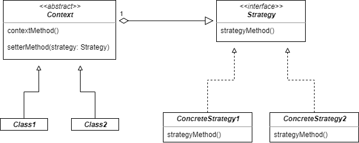

## Strategy Pattern

#### 스트래티지 패턴이란

- 알고리즘군(행위)을 정의하고 각각을 캡슐화하여 교환해서 사용할 수 있도록 한다. 스트래티지 패턴을 사용하면 알고리즘을 사용하는 클라이언트와는 독립적으로 알고리즘을 동적으로 변경할 수 있도록 한다.

<br />



- Strategy
  - 인터페이스나 추상 클래스로 외부에서 동일한 방식으로 알고리즘을 호출하는 방법을 명시
- ConcreteStrategy
  - 스트래티지 패턴에서 명시한 알고리즘을 실제로 구현한 클래스
- Context
  - 스트래티지 패턴을 이용하는 역할을 수행한다.
  - 필요에 따라 동적으로 구체적인 전략을 바꿀 수 있도록 setter 메서드(‘집약 관계’)를 제공한다.
<br />
<br />

### 상속관계를 구현할 때의 문제점

---
##### 수퍼 클래스에 메서드를 추가하기

```kotlin
open class Duck {
    fun quack() {}
    fun swim() {}
    fun display() {}
    fun fly() {}
}

class MallardDuck() : Duck() {}

class RedheadDuck() : Duck() {}

class RubberDuck() : Duck() {}
```

- Duck이라는 수퍼 클래스에 fly() 메서드가 추가되면서 fly()가 있어서는 안 되는 RubberDuck 서브 클래스까지 상속을 받게 된다.
- 코드의 한 부분을 바꿈으로 인해 프로그램 전체에 부작용이 발생한다.

<br />

##### 오버라이드로 문제를 해결할 수 있을까?

```kotlin
open class Duck {
    open fun quack() {}
    fun swim() {}
    fun display() {}
    open fun fly() {}
}

class RubberDuck() : Duck() {
    override fun quack() {
        println("삑삑!")
    }

    override fun fly() {
        // 아무것도 하지 않음
    }
}
```

- 서브 클래스가 추가될 때마다 일일이 quack()과 fly() 메서드를 오버라이드 해야 하는 불편함이 발생한다.

<br />

##### 인터페이스를 만들기

```kotlin
open class Duck {
    fun swim() {}
    fun display() {}
}

interface Quackable {
    fun quack()
}

interface Flyable {
    fun fly()
}

class MallardDuck() : Duck(), Quackable, Flyable {
    override fun quack() {}

    override fun fly() {}
}

class RedheadDuck() : Duck(), Quackable, Flyable {
    override fun quack() {}

    override fun fly() {}
}

class RubberDuck() : Duck(), Quackable {
    override fun quack() {
        println("삑삑!")
    }
}

class DecoyDuck() : Duck() {}
```

- 서브 클래스에서 Flyable, Quackable을 구현하도록 함으로써 일부 문제점을 해결할 수는 있지만, 그러한 행동에 대한 코드 재사용을 전혀 기대할 수 없게 되므로 관리 측면에서 문제점이 발생한다.
- MallardDuck과 RedheadDuck에서 구현해야 하는 fly()와 quack()은 완전히 동일하다. 하지만 인터페이스에서는 구체적인 구현을 할 수 없으므로, 똑같은 코드를 반복해서 작성해야 한다.
- 코틀린은 인터페이스에서 메서드에 구현 내용을 포함할 수 있다. 따라서 이러한 문제를 어느 정도 해결할 수 있다.

<br />

<br />

### 디자인 원칙 적용

---

##### 애플리케이션에서 달라지는 부분을 찾아 달라지지 않는 부분으로부터 분리(캡슐화)한다.

- Duck 클래스에서 달라지는 부분은 fly()와 quack()이다.
- 이러한 행동을 Duck 클래스로부터 갈라내기 위해서 두 메서드를 모두 Duck 클래스로부터 끄집어내서 각 행동을 나타낼 클래스 집합을 새로 만든다.

<br />

##### 구현이 아닌 인터페이스에 맞춰서 프로그래밍 한다.

- 각 행동은 인터페이스로 표현하고, 행동을 구현할 때 이런 인터페이스를 구현한다.
- Duck의 서브 클래스에서는 인터페이스로 표현되는 행동을 하게 된다.
- 따라서 행동을 실제로 구현한 것은 Duck 서브 클래스에 국한되지 않는다.
- 실제 실행 시에 쓰이는 객체가 코드에 의해서 고정되지 않도록, `상위 형식(supertype)에 맞춰서 프로그래밍`함으로써 다형성을 활용하는 것이 핵심이다.

> *"`상위 형식에 맞춰서 프로그래밍 하라 `"는 말은 "변수를 선언할 때는 추상 클래스나 인터페이스 같은 상위 형식으로 선언해야 한다. 객체를 변수에 대입할 때 상위 형식을 구체적으로 구현한 형식이라면 어떤 객체든 집어넣을 수 있기 때문이다. 그렇게 하면 변수를 선언하는 클래스에서 실제 객체의 형식을 몰라도 된다."는 뜻과 같다.*

```kotlin
// 구현에 맞춘 프로그래밍
val d: Dog = Dog()
d.bark()

// 인터페이스/상위 형식에 맞춘 프로그래밍
val animal: Animal = Dog()
animal.makeSound()

// 구체적으로 구현된 객체를 실행 시에 대입하는 프로그래밍
val a = getAnimal()
a.makeSound()
```

<br />

##### 위 원칙들을 적용하여 Duck의 행동을 구현한다.

```kotlin
interface FlyBehavior {
    fun fly()
}

class FlyWithWings : FlyBehavior {
    override fun fly() {
        println("날개로 날아다닙니다.")
    }
}

class FlyNoWay : FlyBehavior {
    override fun fly() {
        println("날 수 없습니다.")
    }
}
```

```kotlin
interface QuackBehavior {
    fun quack()
}

class Quack : QuackBehavior {
    override fun quack() {
        println("꽥꽥!!")
    }
}

class Squack : QuackBehavior {
    override fun quack() {
        println("찍찍!")
    }
}

class MuteQuack : QuackBehavior {
    override fun quack() {
        println("...")
    }
}
```

- 이런 식으로 디자인하면 다른 형식의 객체에서도 나는 행동과 꽥꽥거리는 행동을 재사용할 수 있다. 이러한 행동이 더 이상 Duck 클래스 안에 숨겨져 있지 않기 때문이다.
- 기존 행동 클래스를 수정하거나, Duck 클래스를 전혀 건드리는 일 없이 새로운 행동을 추가할 수 있다.

<br />

<br />

### Duck 행동 통합하기

---

이제 Duck에서 나는 행동과 소리를 내는 행동을 Duck 클래스(또는 그 서브 클래스)에서 정의한 메서드를 써서 구현하지 않고 다른 클래스에 `위임`한다.

```kotlin
abstract class Duck {
    abstract val quackBehavior: QuackBehavior
    abstract val flyBehavior: FlyBehavior

    fun swim() {}

    abstract fun display()

    fun performQuack() {
        quackBehavior.quack()
    }

    fun performFly() {
        flyBehavior.fly()
    }
}

class MallardDuck : Duck() {
    override val quackBehavior: QuackBehavior = Quack()
    override val flyBehavior: FlyBehavior = FlyWithWings()

    override fun display() {
        println("저는 물오리입니다.")
    }
}
```

- Duck 클래스에 flyBehavior와 quackBehavior라는 두 개의 인터페이스 형식의 인스턴스 변수를 추가한다. 각 오리 객체는 실행 시에 이 변수에 특정 행동 양식에 대한 레퍼런스를 다형적으로 설정한다.

<br />

##### 상속보다는 구성을 활용한다.

- `A에는 B가 있다.` : 각 오리에는 FlyBehavior와 QuackBehavior가 있으며, 각각 행동을 위임받는다.
- 두 클래스를 이런 식으로 합치는 것을 `구성`을 이용하는 것이라 부른다. 오리 클래스에서는 행동을 상속받는 대신 올바른 행동 객체로 구성됨으로써 행동을 위임받게 된다.