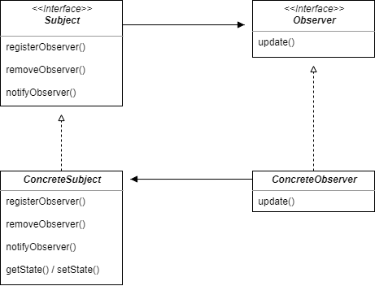

## Observer Pattern

#### 옵저버 패턴이란

한 객체의 상태가 바뀌면 그 객체에 의존하는 다른 객체들한테 연락이 가고 자동으로 내용이 갱신되는 방식으로 일대다(one-to-many) 의존성을 정의한다.

- 데이터의 변경이 발생했을 경우 상대 클래스나 객체에 의존하지 않으면서 데이터 변경을 통보하고자 할 때 유용하다.

<br />

일대다 관계는 주제와 옵저버에 의해 정의된다. 
- 옵저버는 주제에 의존한다. 
- 주제의 상태가 바뀌면 옵저버에게 연락이 가며, 연락 방법에 따라 옵저버에 있는 값이 새로운 값으로 갱신될 수도 있다.

<br />



- 주제를 나타내는 Subject 인터페이스
  - 객체에서 옵저버를 등록하거나 옵저버 목록에서 탈퇴하고 싶을 때 이 인터페이스에 있는 메서드를 사용한다.
- 주제 역할을 하는 ConcreteSubject 구상 클래스
  - 등록 및 해지를 위한 메서드 외에 상태가 바뀔 때마다 모든 옵저버들에게 연락을 하기 위한 notifyObservers() 메서드도 구현해야 한다.
  - 주제 클래스에는 상태를 설정하고 알아내기 위한 게터, 세터 메서드가 있을 수도 있다.

- 옵저버를 나타내는 Observer 인터페이스
  - 옵저버가 될 가능성이 있는 객체에서는 반드시 Observer 인터페이스를 구현해야 한다.
  - 이 인터페이스에는 주제의 상태가 바뀌었을 때 호출되는 update() 메서드가 존재한다.
- 옵저버 역할을 하는 ConcreteObserver 클래스
  - 각 옵저버는 특정 주제 객체에 등록을 해서 연락을 받을 수 있다.

<br />

- 옵저버 패턴은 통보 대상 객체의 관리를 Subject 클래스와 Observer 인터페이스로 일반화한다.
  - 이를 통해 데이터 변경을 통보하는 클래스(ConcreteSubject)는 통보 대상 클래스나 객체(ConcreteObserver)에 대한 의존성을 없앨 수 있다.
  - 결과적으로 통보 대상 클래스나 대상 객체의 변경에도 통보하는 클래스(ConcreteSubject)를 수정 없이 그대로 사용할 수 있다.

<br />

#### 느슨한 결합(Loose Coupling)

옵저버 패턴에서는 주제와 옵저버가 `느슨하게 결합되어 있는 객체 디자인`을 제공한다. 느슨하게 결합되어 있다는 것은 "그 둘이 상호작용을 하긴 하지만 서로에 대해 잘 모른다는 것"을 의미한다.

<br />

- 주제가 옵저버에 대해서 아는 것은 옵저버가 특정 인터페이스(Observer 인터페이스)를 구현한다는 것 뿐이다.
- 옵저버는 언제든지 새로 추가할 수 있다.
- 새로운 형식의 옵저버를 추가하려고 할 때도 주제를 변경할 필요가 없다.
- 주제와 옵저버는 서로 독립적으로 재사용할 수 있다.
- 주제나 옵저버가 바뀌더라도 서로한테 영향을 미치지는 않는다.`

> *"서로 상호작용을 하는 객체 사이에서는 가능하면 느슨하게 결합하는 디자인을 사용해야 한다."*

<br />

<br />

### 기상 관측값의 변경을 보여주는 디스플레이 구현 예시

---
##### 측정값 변경 메서드 구현하기

```kotlin
class subject.WeatherData {
    fun measurementsChanged() {
        val temp: Float = getTemperature()
        val humidity: Float = getHumidity()
        val pressure: Float = getPressure()
        
        currentConditionDisplay.update(temp, humidity, pressure)
        statisticsDisplay.update(temp, humidity, pressure)
        forecastDisplay.update(temp, humidity, pressure)
    }
}
```

- 구체적인 구현에 맞춰서 코딩했기 때문에 프로그램을 고치지 않고서는 다른 디스플레이 항목을 추가/제거할 수 없다.
- 디스플레이 부분은 바뀔 수 있기 때문에 캡슐화를 해야 할 것이다.

<br />

### 옵저버 패턴 적용하기

---

##### 인터페이스 작성

```kotlin
interface Subject {
    fun registerObserver(o: Observer)

    fun removeObserver(o: Observer)

    fun notifyObserver()
}

interface Observer {
    fun update(temp: Float, humidity: Float, pressure: Float)
}

interface DisplayElement {
    fun display()
}
```

<br />

##### subject 인터페이스 구현

```kotlin
class WeatherData : Subject {
    private val observers: ArrayList<Observer> = arrayListOf()
    private var temperature: Float = 0F
    private var humidity: Float = 0F
    private var pressure: Float = 0F

    override fun registerObserver(o: Observer) {
        observers.add(o)
    }

    override fun removeObserver(o: Observer) {
        val index = observers.indexOf(o)
        if (index >= 0) observers.removeAt(index)
    }

    override fun notifyObservers() {
        observers.forEach { it.update(temperature, humidity, pressure) }
    }

    fun measurementsChanged() {
        notifyObservers()
    }

    fun setTemperature(temperature: Float, humidity: Float, pressure: Float) {
        this.temperature = temperature
        this.humidity = humidity
        this.pressure = pressure
        measurementsChanged()
    }
}
```

<br />

##### Observer 인터페이스 구현

```kotlin
class CurrentConditionsDisplay(private val weatherData: Subject) : Observer, DisplayElement {
    private var temperature: Float = 0F
    private var humidity: Float = 0F

    init {
        weatherData.registerObserver(this)
    }

    override fun update(temperature: Float, humidity: Float, pressure: Float) {
        this.temperature = temperature
        this.humidity = humidity
        display()
    }

    override fun display() {
        println("Current conditions: ${temperature}F degrees and ${humidity}% humidity")
    }
}
```
