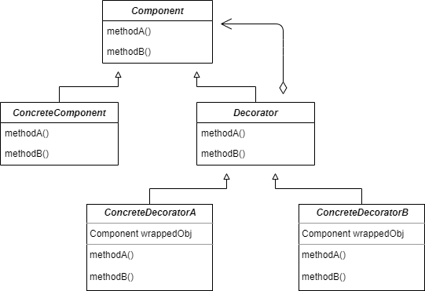

## decorator Pattern

#### 데코레이터 패턴이란

- 객체에 추가적인 요건을 동적으로 첨가하는 패턴. 데코레이터는 서브 클래스를 만드는 것(객체의 결합)을 통해서 기능을 유연하게 확장할 수 있는 방법을 제공한다.
  - 기본 기능에 추가할 수 있는 기능의 종류가 많은 경우에 각 추가 기능을 decorator 클래스로 정의 한 후 필요한 decorator 객체를 조합함으로써 추가 기능의 조합을 설계 하는 방식이다.

<br />

- 데코레이터 패턴에서는 구상 구성요소를 감싸주는 데코레이터를 사용한다.
  - 데코레이터 클래스의 형식은 그 클래스가 감싸고 있는 클래스의 형식을 반영한다 (상속 또는 인터페이스 구현을 통해서 자신이 감쌀 클래스와 같은 형식을 가지게 된다). 
  - 데코레이터에서는 자기가 감싸고 있는 구성요소의 메서드를 호출한 결과에 새로운 기능을 더함으로써 행동을 확장한다. 데코레이터는 자신이 장식하고 있는 객체에게 어떤 행동을 위임하는 것 외에 추가적인 작업을 수행할 수 있다.
  - 객체는 언제든지 감쌀 수 있기 때문에 실행 중에 필요한 데코레이터를 마음대로 적용할 수 있다.

<br />



- Component
  - 기본 기능을 뜻하는 ConcreteComponent와 추가 기능을 뜻하는 Decorator의 공통 기능을 정의한다.
  - 즉, 클라이언트는 Component를 통해 실제 객체를 사용한다.
- ConcreteComponent
  - 기본 기능을 구현하는 클래스.
  - ConcreteComponent에 새로운 행동을 동적으로 추가하게 된다.
- decorator
  - 많은 수가 존재하는 구체적인 Decorator의 공통 기능을 제공한다.
  - 각 데코레이터 안에는 Component 객체가 들어있다.
  - 데코레이터에는 구성요소에 대한 레퍼런스가 들어있는 인스턴스 변수가 존재하는 것이다.
  - 데코레이터는 자신이 장식할 구성요소와 같은 인터페이스 또는 추상 클래스를 구현한다.
- ConcreteDecoratorA, ConcreteDecoratorB
  - Decorator의 하위 클래스로 기본 기능에 추가되는 개별적인 기능을 뜻한다.
  - ConcreteDecorator에는 그 객체가 장식하고 있는 것(데코레이터가 감싸고 있는 Component 객체)을 위한 인스턴스 변수가 있다.
  - Decorator는 Component의 상태를 확장할 수 있다.

<br />

#### 데코레이터 패턴을 사용할 시 유의할 점

- 데코레이터 패턴은 추상 구성요소 형식을 바탕으로 돌아가는 코드에 대해서 데코레이터 패턴을 적용해야만 제대로 된 결과를 얻을 수 있다.
  - 구상 구성요소의 형식을 알아내서 그 결과를 바탕으로 어떤 작업을 처리하는 코드에 데코레이터 패턴을 적용하면 제대로 작동하지 않는다.
- 데코레이터 패턴을 사용하면 관리해야 할 객체가 늘어나고, 그에 따라 코딩하는 과정에서 실수를 할 가능성이 높아진다.
- 데코레이터는 그 데코레이터가 감싸고 있는 객체에 행동을 추가하기 위한 용도로 만들어진 것이다. 만약 여러 단계의 데코레이터를 파고 들어가서 어떤 작업을 해야 한다면, 원래 데코레이터 패턴이 만들어진 의도와 어긋나는 것이다.

<br />

#### OCP(Open-Closed Principle)

클래스는 확장에 대해서는 열려 있어야 하지만 코드 변경에 있어서는 닫혀 있어야 한다.

<br />

<br />

### 커피 메뉴판 구현 예시

---
```kotlin
abstract class Beverage {
    abstract val description: String

    abstract fun cost()
}

class HouseBlend : Beverage() {
    override val description: String = "HouseBlend"

    override fun cost() {}
}

class HouseBlendWithSteamedMilkAndMocha : Beverage() {
    override val description: String = "HouseBlendWithSteamedMilkAndMocha"

    override fun cost() {}
}

...
```

- 카페의 메뉴가 추가됨에 따라 지나치게 많은 구상 클래스가 구현되게 된다.

<br />

##### 프로퍼티를 추가하고, cost()를 추상 메서드에서 일반 메서드로 변경하기

```kotlin
abstract class Beverage {
    abstract val description: String
    var milkCost = 0.1F
    var soyCost = 0.15F
    var mochaCost = 0.2F
    var whipCost = 0.1F
    abstract val milk: Boolean
    abstract val soy: Boolean
    abstract val mocha: Boolean
    abstract val whip: Boolean

    fun cost(): Float {
        var resultCost = 0F
        if (milk) resultCost += milkCost
        if (soy) resultCost += soyCost
        if (mocha) resultCost += mochaCost
        if (whip) resultCost += whipCost
        return resultCost
    }
}
```

<br />

```kotlin
class DarkRoast : Beverage() {
    override val description: String = "다크로스트 커피"
    override val milk = false
    override val soy = false
    override val mocha = false
    override val whip = false

    override fun cost(): Float {
        return 1.5F + super.cost()
    }
}
```

- 그러나 이러한 방식으로 구현할 경우 첨가물 가격이 바뀔 때마다 기존 코드를 수정해야 한다.
- 첨가물의 종류가 많아지면 새로운 메서드를 추가해야 하고, 수퍼 클래스의 cost() 메서드도 변경해야 한다.
- 기존 첨가물이 들어가면 안 되는 새로운 음료가 출시될 수도 있을 것이다.

<br />

### 데코레이터 패턴 적용하기

##### Beverage 클래스(Component) 및 CondimentDecorator 클래스(Decorator) 구현

```kotlin
abstract class Beverage {
    open var description: String = "제목 없음"
      get(): String = field

    abstract fun cost(): Double
}

abstract class CondimentDecorator : Beverage() {
}
```

<br />

##### 음료 클래스(ConcreteComponent) 구현

```kotlin
class DarkRoast : Beverage() {
    override val description = "하우스 블렌드 커피"

    override fun cost() = 0.89
}

class Espresso : Beverage() {
    override val description = "에스프레소"

    override fun cost() = 1.99
}
```

<br />

##### 첨가물 클래스(ConcreteDecorator) 구현

```kotlin
class Mocha(val beverage: Beverage) : CondimentDecorator() {
    override val description: String
        get() = "${beverage.description} 모카"


    override fun cost() = 0.2 + beverage.cost()
}
```

