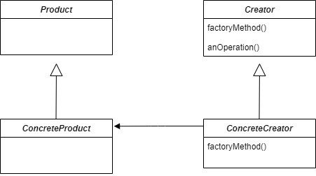

## Factory Pattern

#### 팩토리 메소드 패턴이란

- 팩토리 메소드 패턴에서는 객체를 생성하기 위한 인터페이스를 정의하는데, 어떤 클래스의 인스턴스를 만들지는 서브 클래스에서 결정하게 만든다.
  - 구상 형식의 인스턴스를 만드는 작업을 캡슐화 한다.
  - 실제 팩토리 메소드를 구현하고 제품을 만들어내는 일은 서브 클래스에서만 할 수 있다.

<br />



- Product
  - 팩토리 메소드로 생성될 객체의 공통 인터페이스
  - 제품 클래스에서는 모두 똑같은 인터페이스를 구현해야 한다.
- ConcreteProduct
  - Product의 구상 클래스
- Creator
  - 제품을 갖고 원하는 일을 하기 위한 모든 메소드들이 구현되어 있는 클래스
  - 팩토리 메소드를 포함하고 있으며, 팩토리 메소드는 추상 메소드로 정의되어 있을 뿐 구현되어 있지는 않다.
  - Creator의 모든 서브 클래스에서 factoryMethod() 추상 메소드를 구현해야 한다.
- ConcreteCreator
  - 실제로 제품을 생산하는 클래스
  - factoryMethod()를 구현한다.
  - 구상 클래스 인스턴스를 만들어내는 일을 책임진다.

<br />

#### 의존성 뒤집기 원칙(Dependency Inversion Principle)

추상화된 것에 의존하도록 만들어라. 구상 클래스에 의존하도록 만들면 안 된다.

- 어떤 변수에도 구상 클래스에 대한 레퍼런스를 저장하면 안 된다.
- 구상 클래스에서 유도된 클래스를 만들면 안 된다.
- 베이스 클래스에 이미 구현되어 있는 메소드를 오버라이드 하지 말아야 한다.

<br />

<br />

### 피자 가게 구현 예시

---
```kotlin
class PizzaStore() {
    fun orderPizza(type: String): Pizza? {
        // 바뀌는 부분
        val pizza = when(type) {
            "cheese" -> CheesePizza()
            "greek" -> GreekPizza()
            "pepperoni" -> PepperoniPizza()
            else -> null
        }

        // 바뀌지 않는 부분
        return pizza?.apply {
            prepare()
            bake()
            cut()
            box()
        }
    }
}
```

- 피자 가게에서 신제품을 출시하거나 메뉴가 사라진다면 바뀔 때마다 메소드가 변경되어야 한다. 인스턴스를 만드는 구상 클래스 부분이 가장 문제가 된다.

<br />

##### 간단한 팩토리 : 피자(객체)를 생성하는 일만 처리하는 객체(팩토리)를 만들어 분리하기.

```kotlin
class SimplePizzaFactory() {
    fun createPizza(type: String): Pizza? {
        return when(type) {
            "cheese" -> CheesePizza()
            "greek" -> GreekPizza()
            "pepperoni" -> PepperoniPizza()
            else -> null
        }
    }
}

class PizzaStore(val factory: SimplePizzaFactory) {
    fun orderPizza(type: String): Pizza? {
        return factory.createPizza(type)?.apply {
            prepare()
            bake()
            cut()
            box()
        }
    }
}
```

- 피자를 생성하는 작업을 한 클래스에 캡슐화시켜 놓으면 구현을 변경해야 하는 경우에 여기저기 다 들어가서 고칠 필요 없이 이 팩토리 클래스 하나만 고치면 된다.
-  PizzaStore의 생성자에 팩토리 객체를 전달해 팩토리에서 피자 객체를 생성하도록 한다. 이제 더 이상 구상 클래스의 인스턴스를 만들 필요가 없다.

<br />

<br />

### 팩토리 메소드 패턴

##### 피자 사업이 커져 프랜차이즈가 된다면...?

```kotlin
abstract class PizzaStore {
    fun orderPizza(type: String): Pizza? {
        return createPizza(type)?.apply {
            prepare()
            bake()
            cut()
            box()
        }
    }

    // 팩토리 역할을 하는 메소드
    abstract fun createPizza(type: String): Pizza?
}

class NYPizzaStore : PizzaStore() {
    override fun createPizza(type: String): Pizza? = when (type) {
        "cheese" -> NYStyleCheesePizza()
        "pepperoni" -> NYStylePepperoniPizza()
        "clam" -> NYStyleClamPizza()
        "veggie" -> NYStyleVeggiePizza()
        else -> null
    }
}

class ChicagoPizzaStore : PizzaStore() {
    override fun createPizza(type: String): Pizza? = when (type) {
        "cheese" -> ChicagoStyleCheesePizza()
        "pepperoni" -> ChicagoStylePepperoniPizza()
        "clam" -> ChicagoStyleClamPizza()
        "veggie" -> ChicagoStyleVeggiePizza()
        else -> null
    }
}
```

- 피자 객체를 생성하는 추상 메소드를 생성한다.
- 달라지는 점은 createPizza() 메소드에 집어넣고 그 메소드에서 해당 스타일의 피자를 만드는 것을 모두 책임지도록 한다.
- orderPizza() 메소드에서 Pizza 객체를 가지고 여러가지 작업을 하지만, Pizza는 추상 클래스기 때문에 orderPizza()에서는 실제로 어떤 구상 클래스에서 작업이 처리되고 있는지 전혀 알 수가 없다는 것을 알 수 있다.
- Pizza와 PizzaStore는 완전히 분리되어 있다.

<br />

##### 팩토리 메소드

```kotlin
abstract fun factoryMethod(type: String): Product
```

- 팩토리 메소드는 객체 생성을 처리하며, 팩토리 메소드를 이용하면 객체를 생성하는 작업을 서브 클래스에 캡슐화시킬 수 있다(서브 클래스에서 어떤 클래스를 만들지를 결정하게 함). 이렇게 하면 수퍼 클래스에 있는 클라이언트 코드와 서브 클래스에 있는 객체 생성 코드를 분리시킬 수 있다.
- 팩토리 메소드를 만들 때 매개 변수를 써서 만들어낼 객체 종류를 선택할 수 있다.
- 팩토리 메소드는 클라이언트에서 실제로 생성되는 구상 객체가 무엇인지 알 수 없게 만드는 역할도 한다.
- 팩토리 메소드는 특정 제품을 리턴하며, 그 객체는 보통 수퍼 클래스에서 정의한 메소드 내에서 쓰이게 된다.

<br />

##### 

```kotlin

```

