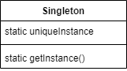

## Singleton Pattern

#### 싱글턴 패턴이란

해당 클래스의 인스턴스가 오직 하나만 만들어지고, 어디서든지 그 인스턴스에 접근할 수 있도록 하기 위한 패턴.
- 클래스에서 자신의 단 하나뿐인 인스턴스를 관리하도록 해야 한다. 다른 어떤 클래스에서도 자신의 인스턴스를 추가로 만들지 못하도록 해야 한다.
- 어디서든 그 인스턴스에 접근하지 못하도록 만들어야 한다. 다른 객체에서 이 인스턴스가 필요하면 언제든지 클래스에게 요청을 할 수 있게 만들고, 요청이 들어오면 그 하나 뿐인 인스턴스를 건네주도록 만들어야 한다.

<br />



- uniqueInstance
  - 클래스의 유일무이한 인스턴스가 저장되는 변수
- getInstance()
  - 싱글턴 객체를 호출할 수 있는 메소드.
  - 언제 어디서든 호출할 수 있도록 정적 메소드로 구성한다.

<br />

#### 정적 클래스가 아닌 싱글턴 패턴을 사용하는 이유

1. 필요한 내용이 클래스에 다 들어 있고, 복잡한 초기화가 필요하지 않은 경우에만 정적 클래스를 싱글턴과 동일하게 사용할 수 있다.
2. 게으른 인스턴스 생성을 할 수 없다. 처음부터 끝까지 인스턴스를 가지고 있어야 한다.
3. 전역 변수를 사용하다 보면 간단한 객체에 대한 전역 레퍼런스를 자꾸 만들게 되면서 네임스페이스를 지저분하게 만드는 경향이 생기게 된다.

<br />

<br />

### 고전적인 싱글턴 패턴

---
```kotlin
class ClassicSingleton private constructor() {
    companion object {
        // ClassincSingleton 클래스의 유일한 인스턴스를 저장하기 위한 정적 변수
        private var uniqueInstance: ClassicSingleton? = null

        fun getInstance(): ClassicSingleton {
            if (uniqueInstance == null) {
                uniqueInstance = ClassicSingleton()
            }
            
            return uniqueInstance!!
        }
    }
}
```

- 생성자를 private으로 선언해 ClassicSingleton에서만 클래스의 인스턴스를 만들 수 있다.
- 아직 인스턴스가 만들어지지 않았다면 private으로 선언된 생성자를 이용해 Single 객체를 만든 다음 uniqueInstance에 대입한다. `게으른 인스턴스 생성(lazy instantiation) `
- 싱글턴 객체가 필요할 때는 인스턴스를 직접 만드는 것이 아니고, 인스턴스를 달라고 요청을 해야 한다.

<br />

<br />

### 초콜릿 공장 예시

##### 간단한 팩토리 : 피자(객체)를 생성하는 일만 처리하는 객체(팩토리)를 만들어 분리하기.

```kotlin
class ChocolateBoiler private constructor() {
    private var empty = true
    private var boiled = false

    companion object {
        private var uniqueInstance: ChocolateBoiler? = null

        fun getInstance(): ChocolateBoiler {
            if (uniqueInstance == null) {
                uniqueInstance = ChocolateBoiler()
            }
            return uniqueInstance!!
        }
    }

    fun fill() {
        if (empty) {
            empty = false
            boiled = false
        }
    }

    fun drain() {
        if (!empty && boiled) {
            empty = true
        }
    }

    fun boil() {
        if (!empty && !boiled) {
            boiled = true
        }
    }
}
```

- ChocolateBoiler 인스턴스가 두 개 이상 만들어지지 않도록 싱글턴으로 구성한다.

<br />

##### 멀티 스레드에서의 문제점

```kotlin
@Synchronized fun getInstance(): ChocolateBoiler {
            if (uniqueInstance == null) {
                uniqueInstance = ChocolateBoiler()
            }
            return uniqueInstance!!
        }
```

- 여러 스레드가 동시에 getInstance() 함수를 호출할 경우 여러 개의 인스턴스가 생성되는 문제가 발생한다.
- 이를 막기 위해 @Synchronized 키워드를 선언한다. 한 스레드가 메소드 내용을 끝내기 전까지 다른 스레드는 기다리게 된다.
- 하지만 동기화가 꼭 필요한 시점은 이 메소드가 실행되는 때 뿐이다. 일단 uniqueInstance가 생성되고 나면 굳이 이 메소드를 동기화된 상태로 유지할 필요가 없는 것이다. 불필요한 오버헤드가 증가하게 된다.

<br />

##### 해결 방안

```kotlin
// 1. getInstance()의 속도가 중요하지 않다면 그냥 둔다.

// 2. 인스턴스를 필요할 때 생성하지 말고, 처음부터 만들어버린다.
private val uniqueInstance = ChocolateBoiler()

fun getInstance(): ChocolateBoiler {
    return uniqueInstance
}

// 3. DCL(Double-Checking-Locking)을 써서 getInstance()에서 동기화되는 부분을 줄인다.
@Volatile private var uniqueInstance: ChocolateBoiler? = null

fun getInstance(): ChocolateBoiler {
    if (uniqueInstance == null) {
        synchronized (ChocolateBoiler::class.java) {
            if (uniqueInstance == null) {
                uniqueInstance = ChocolateBoiler()
            }
        }
    }
    return uniqueInstance!!
}

// 4. 코틀린의 지연 초기화를 이용한다.
private val uniqueInstance by lazy { ChocolateBoiler() }

fun getInstance(): ChocolateBoiler {
    return uniqueInstance
}
```

- DCL을 사용하면, 일단 인스턴스가 생성되어 있는지 확인한 다음 생성되지 않았을 때만 동기화를 할 수 있다.
- Volatile 키워드를 사용하면 멀티스레드를 사용하더라도 uniqueInstance 변수가 Singleton 인스턴스로 초기화되는 과정이 올바르게 진행되도록 할 수 있다.
