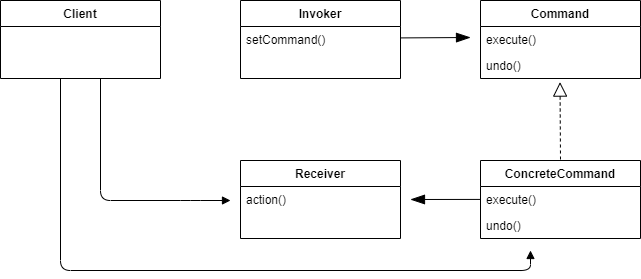

## Command Pattern

#### 커맨드 패턴이란

요구 사항(실행할 기능)을 객체로 캡슐화 하여, 매개변수를 통해 주어진 여러 요구 사항을 실행할 수 있는 패턴. 요청 내역을 큐에 저장하거나 로그로 기록할 수도 있으며, 작업 취소 기능도 지원 가능하다.
- 일련의 행동을 특정 리시버하고 연결시킴으로써 요구 사항을 캡슐화 한다.
- 이를 위해 행동과 리시버를 한 객체에 집어넣고, execute()라는 메소드 하나만 외부에 공개하는 방법을 사용한다.
- 외부에서 볼 때는 어떤 객체가 리시버 역할을 하는지, 그 리시버에서 실제로 어떤 일을 수행하는지 알 수 없다.
- 실행할 기능을 캡슐화함으로써 기능의 실행을 요청하는 인보커 클래스와 기능을 실제로 실행하는 리시버 클래스 사이의 의존성을 제거한다.

<br />



- Command
  - 모든 커맨드 객체에서 구현해야 하는 인터페이스.
  - 모든 명령은 execute() 메소드 호출을 통해 수행되며, 이 메소드에서는 리시버에 특정 작업을 수행하라는 지시를 전달한다.
- ConcreteCommand
  - Command 인터페이스의 구상 클래스. 실제로 실행되는 기능이 구현된다.
  - 특정 행동과 리시버 사이를 연결해준다. execute() 호출을 통해 요청하면 ConcreteCommand 객체에서 리시버에 있는 메소드를 호출함으로써 그 작업을 처리한다.
- Invoker
  - 기능의 실행을 요청하는 호출자 클래스.
  - 명령이 들어 있으며, execute() 메소드를 호출함으로써 커맨드 객체에게 특정 작업을 수행해 달라는 요구를 하게 된다.
- Receiver
  - ConcreteCommand의 기능을 실행하기 위해 사용하는 수신자 클래스.
  - 요구 사항을 수행하기 위해 어떤 일을 처리해야 하는지 알고 있는 객체이다.

<br />

<br />

### 커맨드 패턴 이해하기

##### 식당에서 주문할 때

---
```kotlin
1. 주문하기 : createOrder() - 손님

2. 주문 받기 : takeOrder() - 웨이터

3. 주문 준비하기 : orderUp() - 웨이터

4. 주문 처리 요청하기 : makeBurger(), makeShake()... - 주문서
```

- `주문서`는 주문한 메뉴를 캡슐화한다.
- 주문한 메뉴를 요구하는 역할을 하는 객체. 다른 객체와 마찬가지로 여기저기로 전달될 수 있다.
  - 식사를 준비하기 위한 행동을 캡슐화한 메소드인 `orderUp() `과 식사를 주문해야 하는 객체 `주방장`이 들어있다.
- 이런 내용은 캡슐화되어 있기 때문에 `웨이터`는 어떤 내용이 주문되었는지, 누가 식사를 준비할지 등을 전혀 몰라도 된다.
  <br />
- `웨이터`는 주문서를 받아서 orderUp() 메소드를 호출한다.
  - `takeOrder()` 메소드에는 여러 고객이 여러 주문서를 매개변수로 전달한다.
  - 모든 주문서에는 orderUp() 메소드가 있고, 그것을 호출한다.
- `주방장`은 식사를 준비하는 데 필요한 정보를 가지고 있다.
  - 웨이터가 orderUp() 메소드를 호출하면 주방장이 그 주문을 받아서 음식을 만들기 위한 메소드를 처리한다.

<br />

##### 커맨드 패턴으로 변환한다면

```kotlin
class Client {
    fun createCommandObject() {
        // 커맨드 객체(주문서)에는 리시버(주방장)에 대한 정보가 같이 들어있다.
    }
}

class Invoker {
    fun setCommand() {
        // 클라이언트는 인보커 객체(웨이터)의 setCommand() 메소드를 호출하는데, 이때 커맨드 객체를 넘겨준다. 이 커맨드 객체는 나중에 쓰이기 전까지 인보커에 보관된다.
    }
}

class Command {
    fun execute() {
        // 커맨드 객체에는 행동과 리시버에 대한 정보가 같이 들어 있다.
        // 커맨드 객체에서 제공하는 메소드는 execute() 하나 뿐이다. 이 메소드는 행동을 캡슐화 하며, 리시버에 있는 '특정 행동을 처리하기 위한 메소드'를 호출하는 메소드이다.
        receiver.action1()
        receiver.action2()
    }
}

class Receiver {
    // 커맨드 객체의 execute()를 통해 호출된다.
    fun action1() {
        
    }
    
    fun action2() {
        
    }
}
```

- 인보커 로딩

1. 클라이언트에서 커맨드 객체 생성.
2. setCommand()를 호출하여 인보커에 커맨드 객체를 저장.
3. 나중에 클라이언트에서 인보커한테 그 명령을 실행시켜 달라는 요청을 함.

<br />

### 전자제품 리모컨 예시

##### 커맨드 객체 만들기

```kotlin
// 리시버
class Light {
    fun on() {
        println("전등이 켜졌습니다.")
    }

    fun off() {
        println("전등이 꺼졌습니다.")
    }
}


// 커맨드 인터페이스
interface Command {
    fun execute()
}


// 커맨드 구상 클래스
class LightOnCommand(val light: Light) : Command {
    override fun execute() {
        light.on()
    }
}


// 인보커
class SimpleRemoteControl {
    var slot: Command? = null

    fun setCommand(command: Command) {
        slot = command
    }

    fun buttonWasPressed() {
        slot?.execute()
    }
}
```

<br />

##### 여러 가지 기능이 있는 리모컨

```kotlin
class RemoteControl {
    private val noCommand = NoCommand()
    private val onCommands = Array<Command>(7) { noCommand }
    private val offCommands = Array<Command>(7) { noCommand }

    fun setCommand(slot: Int, onCommand: Command, offCommand: Command) {
        onCommands[slot] = onCommand
        offCommands[slot] = offCommand
    }

    fun onButtonWasPushed(slot: Int) {
        onCommands[slot].execute()
    }

    fun offButtonWasPushed(slot: Int) {
        offCommands[slot].execute()
    }
}
```

<br />

##### 작업 취소 기능 구현하기

```kotlin
interface Command {
    fun execute()

    fun undo()
}


class LightOnCommand(val light: Light) : Command {
    override fun execute() {
        light.on()
    }

    override fun undo() {
        light.off()
    }
}


class RemoteControl {
    private val noCommand = NoCommand()
    private val onCommands = Array<Command>(7) { noCommand }
    private val offCommands = Array<Command>(7) { noCommand }
    private var undoCommand: Command = NoCommand()

    fun setCommand(slot: Int, onCommand: Command, offCommand: Command) {
        onCommands[slot] = onCommand
        offCommands[slot] = offCommand
    }

    fun onButtonWasPushed(slot: Int) {
        onCommands[slot].execute()
        undoCommand = onCommands[slot]
    }

    fun offButtonWasPushed(slot: Int) {
        offCommands[slot].execute()
        undoCommand = offCommands[slot]
    }

    fun undoButtonWasPushed() {
        undoCommand.undo()
    }
}
```

- undo() 메소드를 추가해 불을 끄는 메소드를 호출한다.
- 마지막으로 실행된 명령을 기록하기 위한 인스턴스 변수를 추가하고 사용자가 undo 버튼을 누르면 기록해뒀던 커맨드 객체 레퍼런스를 이용해서 undo() 메소드를 호출한다.
