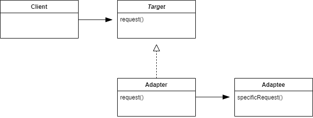

## Adapter Pattern

#### 어댑터 패턴이란

한 클래스의 인터페이스를 클라이언트에서 사용하고자 하는 다른 인터페이스로 변환한다. 어댑터를 이용하면 인터페이스 호환성 문제 때문에 같이 쓸 수 없는 클래스들을 연결해서 쓸 수 있다.
- 어댑터 패턴을 통해 호환되지 않는 인터페이스를 사용하는 클라이언트를 그대로 활용할 수 있다.
- 이렇게 함으로써 클라이언트와 구현된 인터페이스를 분리시킬 수 있으며, 나중에 인터페이스가 바뀌더라도 그 변경 내역은 어댑터에 캡슐화되기 때문에 클라이언트는 바뀔 필요가 없다.

<br />



- Target
  - 클라이언트에서 사용될 인터페이스.
- Adapter
  - 타겟 인터페이스를 구현한 어댑터.
  - 어댑터는 어댑티로 구성되어 있다.
- Adaptee
  - 타겟 인터페이스로 변환될 인터페이스.
  - 모든 요청은 어댑티에 위임된다.

<br />

#### 최소 지식 원칙 

> 정말 친한 친구하고만 얘기하라

시스템을 디자인할 때, 어떤 객체든 그 객체와 상호작용을 하는 클래스의 개수에 주의해야 하며, 그런 객체들과 어떤 식으로 상호작용을 하는지에도 주의를 기울여야 한다.

다음 네 종류 객체의 메소드만을 호출한다.

1. 객체 자체.
2. 메소드에 매개 변수로 전달된 객체.
3. 그 메소드에서 생성하거나 인스턴스를 만든 객체.
4. 그 객체에 속하는 구성 요소.

```kotlin
// 바람직하지 않은 방법
fun getTemp(): Float {
    Thermometer thermometer = station.getThermometer()
    return thermometer.getTemperature()
}

// 바람직한 방법
fun getTemp(): Float {
    return station.getTemperature()
}
```


<br />

<br />

### 오리 클래스 예시

---
```kotlin
interface Duck {
    fun quack()

    fun fly()
}

class MallardDuck : Duck {
    override fun quack() {
        println("Quack")
    }

    override fun fly() {
        println("I'm flying")
    }
}

interface Turkey {
    fun gobble()

    fun fly()
}

class WildTurkey : Turkey {
    override fun gobble() {
        println("Gobble gobble")
    }

    override fun fly() {
        println("I'm flying a short distance")
    }
}
```

- Duck 객체가 모자라서 Turkey 객체를 대신 사용해야 하는 상황이라고 할 때, 인터페이스가 다르기 때문에 Turkey 객체를 바로 사용할 수는 없다.

<br />

##### Duck을 위한 TurkeyAdapter 만들기

```kotlin
class TurkeyAdapter(val turkey: Turkey) : Duck {
    override fun quack() {
        turkey.gobble()
    }

    override fun fly() {
        for (i in 1..5) {
            turkey.fly()
        }
    }
}
```

- 적응시킬 형식의 인터페이스를 구현해야 한다. 클라이언트에서 원하는 인터페이스를 구현해야 한다.
- 원래 형식에 대한 레퍼런스가 필요하다. 여기에서는 생성자에서 레퍼런스를 받아오는 작업을 처리한다.

<br />

##### 클라이언트에서 어댑터를 사용하는 방법

1. 클라이언트에서 타겟 인터페이스를 요청하여 메소드를 호출함으로써 어댑터에 요청을 한다.
2. 어댑터에서는 어댑터 인터페이스를 사용하여 그 요청을 어댑티에 대한 (하나 이상의) 메소드 호출로 변환한다.
3. 클라이언트에서는 호출 결과를 받긴 하지만 중간에 어댑터가 껴 있는지는 알지 못한다.

<br />

### Enumeration과 Iterator 예시

##### Enumeration과 Iterator의 구성

```kotlin
// Adaptee
interface Enumeration {
    fun hasMoreElements()
    
    fun nextElement()
}


// Target
interface Iterator {
    fun hasNext()
    
    fun next()
    
    fun remove()
}
```

<br />

##### 어댑터를 사용해 연결하기

```kotlin
class EnumerationAdapter(val enumeration: Enumeration) : Iterator {
    override fun hasNext() {
        enumeration.hasMoreElements()
    }
    
    override fun next() {
        enumeration.nextElement()
    }
    
    override fun remove() {
        throw UnsupportedOperationException()
    }
}
```
