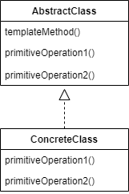

## Template Method Pattern

#### 템플릿 메소드 패턴이란

메소드에서 알고리즘의 골격을 정의하는 패턴. 알고리즘의 여러 단계는 서브 클래스에서 구현할 수 있다. 템플릿 메소드를 이용하면 알고리즘의 구조는 그대로 유지하면서 서브클래스에서 특정 단계를 재정의할 수 있다.
- 알고리즘의 템플릿(틀)을 만들기 위한 패턴.
- 템플릿은 일련의 단계들로 알고리즘을 정의한 메소드이다.
- 여러 단계 가운데 하나 이상이 추상 클래스로 정의되며, 그 추상 클래스는 서브클래스에서 구현된다.

<br />



- AbstractClass
  - 템플릿 메소드가 들어 있는 클래스.
  - abstract로 선언된 단계들이 템플릿 메소드에서 활용된다.
  - 하위 클래스에 공통 알고리즘을 정의하고 하위 클래스에서 구현될 기능을 primitive 메서드 또는 hook 메서드로 정의한다.
- ConcreteClass
  - premitive 메서드 또는 hook 메서드를 구현하는 클래스.
  - 각 클래스에서는 템플릿 메소드에서 제공하는 모든 단계들을 제공해야 한다.

<br />

#### 후크(hook)

추상 클래스에서 선언되는 메소드긴 하지만 기본적인 내용만 구현되어 있거나 아무 코드도 들어 있지 않은 메소드. 이렇게 하면 서브 클래스 입장에서는 다양한 위치에서 알고리즘에 끼어들 수 있다.

<br />

#### 할리우드 원칙 

> 먼저 연락하지 마세요. 저희가 연락 드리겠습니다.

`의존성 부패(dependency rot)`를  방지할 수 있는 원칙. 어떤 고수준 구성 요소가 저수준 구성 요소에 의존하고, 그 저수준 구성 요소는 다시 고수준 구성 요소에 의존하는 식으로 의존성이 복잡하게 꼬여 있는 것을 의존성 부패라고 부른다.

할리우드 원칙을 사용하면, 저수준 구성 요소에서 시스템에 접속을 할 수는 있지만, 언제 어떤 식으로 그 구성 요소들을 사용할지는 고수준 구성 요소에서 결정하게 된다.

<br />

<br />

### 커피 바리스타 예시

##### 커피와 홍차를 만들기 위해선...

---
```kotlin
// 커피 만들기
1. 물을 끓인다.
2. 끓는 물에 커피를 우려낸다.
3. 커피를 컵에 따른다.
4. 설탕과 우유를 추가한다.

// 홍차 만들기
1. 물을 끓인다.
2. 끓는 물에 홍차를 우려낸다.
3. 홍차를 컵에 따른다.
4. 설탕과 우유를 추가한다.

class Coffee {
    fun prepareRecipe() {
        boilWater()
        brewCoffeeGrinds()
        pourInCup()
        addSugarAndMilk()
    }

    fun boilWater() {
        println("물 끓이는 중")
    }
    
    fun brewCoffeeGrinds() {
        println("필터를 통해서 커피 우려내는 중")
    }
    
    fun pourInCup() {
        println("컵에 따르는 중")
    }
    
    fun addSugarAndMilk() {
        println("설탕과 우유를 추가하는 중")
    }
}


class Tea {
    fun prepareRecipe() {
        boilWater()
        steepTeaBag()
        pourInCup()
        addLemon()
    }

    fun boilWater() {
        println("물 끓이는 중")
    }

    fun steepTeaBag() {
        println("필터를 통해서 홍차 우려내는 중")
    }

    fun pourInCup() {
        println("컵에 따르는 중")
    }

    fun addLemon() {
        println("레몬을 추가하는 중")
    }
}
```

- 커피와 홍차를 만드는 과정이 거의 똑같다.
- 공통적인 부분을 추상화시켜서 베이스 클래스를 만들 필요성이 생긴다.
- brewCoffeeGrinds()와 steepTeaBag(), addSugarAndMilk()와 addLemon()는 달라 보이지만 사실 똑같은 역할을 수행한다.
- 따라서 prepareRecipe() 자체를 추상화 해야 한다.

<br />

##### prepareRecipe() 추상화 하기

```kotlin
abstract class CaffeineBeverage {
    fun prepareRecipe() {
        boilWater()
        brew()
        pourInCup()
        addCondiments()
    }

    abstract fun brew()

    abstract fun addCondiments()

    private fun boilWater() {
        println("물 끓이는 중")
    }

    private fun pourInCup() {
        println("컵에 따르는 중")
    }
}


class Coffee : CaffeineBeverage() {
    override fun brew() {
        println("필터를 통해서 커피 우려내는 중")
    }

    override fun addCondiments() {
        println("설탕과 우유를 추가하는 중")
    }
}


class Tea : CaffeineBeverage() {
    override fun brew() {
        println("필터를 통해서 홍차 우려내는 중.")
    }

    override fun addCondiments() {
        println("레몬을 추가하는 중")
    }
}
```

- 커피를 우리는 것과 홍차를 우리는 것은 사실상 같은 것이기 때문에 brew()라는 이름을 가진 메소드를 새로 만들고 이 이름의 메소드를 쓰도록 한다.
- 설탕 및 우유를 추가하는 것과 레몬을 추가하는 것 역시 마찬가지다.
- 이 추상 클래스에서 prepareRecipe()가 `템플릿 메소드`가 된다. 어떤 알고리즘에 대한 템플릿(틀) 역할을 하기 때문이다.

<br />

##### hook의 이해

```kotlin
abstract class CaffeineBeverageWithHook {
    fun prepareRecipe() {
        boilWater()
        brew()
        pourInCup()
        if (customerWantsCondiments()) {
            addCondiments()
        }
    }

    abstract fun brew()

    abstract fun addCondiments()

    private fun boilWater() {
        println("물 끓이는 중")
    }

    private fun pourInCup() {
        println("컵에 따르는 중")
    }

    open fun customerWantsCondiments(): Boolean {
        return true
    }
}
```

- customerWantsCondiments()는 별 다른 기능을 구현해 놓지 않은 기본 메소드이다. 하지만 서브 클래스에서 필요에 따라 오버라이드 할 수 있는 메소드이므로 `후크`이다.

<br />

##### 어댑터를 사용해 연결하기

```kotlin
class EnumerationAdapter(val enumeration: Enumeration) : Iterator {
    override fun hasNext() {
        enumeration.hasMoreElements()
    }
    
    override fun next() {
        enumeration.nextElement()
    }
    
    override fun remove() {
        throw UnsupportedOperationException()
    }
}
```
