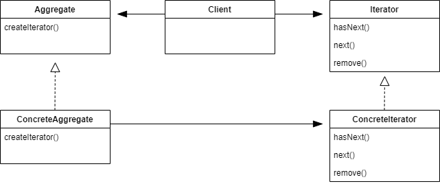

## Iterator Pattern

#### 이터레이터 패턴이란

컬렉션 구현 방법을 노출시키지 않으면서도 그 집합체 안에 들어 있는 모든 항목에 접근할 수 있게 해 주는 방법을 제공한다.
- 집합체 내에서 어떤 식으로 일이 처리되는지 전혀 모르는 상태에서 그 안에 들어 있는 모든 항목들에 대해 반복 작업을 수행할 수 있다.
- 컬렉션 객체 안에 들어 있는 모든 항목에 접근하는 방식이 통일되어 있으면 어떤 종류의 집합체에 대해서도 사용할 수 있는 다형적인 코드를 만들 수 있다.
- 이터레이터 패턴을 사용하면 모든 항목에 일일이 접근하는 작업을 컬랙션 객체가 아니라 반복자 객체에서 맡게 된다. 이렇게 하면 집합체의 인터페이스 및 구현이 간단해질 뿐만 아니라 집합체에서는 반복 작업에 손을 뗴고 원래 자신이 할 일에만 전념할 수 있게 된다.

<br />



- Iterator
  - 모든 반복자에서 구현해야 할 인터페이스.
  - 컬렉션에 들어 있는 원소들에 돌아가면서 접근할 수 있는 메소드를 제공한다..
- ConcreteIterator
  - Iterator를 구현한 클래스.
  - 반복 작업 중에 현재 위치를 관리하는 역할을 맡는다.
- Aggregate
  - 이터레이터를 사용할 객체 인터페이스.
  - 공통적인 인터페이스를 사용하면 클라이언트 입장에서 객체 컬렉션의 구현이 분리될 수 있기 때문에 편리하다.
- ConcreteAggregate
  - 객체 컬렉션이 들어 있으며, 그 안에 들어 있는 컬렉션에 대한 Iterator를 리턴하는 메소드를 구현한다.
  - 모든 ConcreteAggregate는 그 안에 있는 컬렉션에 대해 돌아가면서 반복 작업을 처리할 수 있게 해 주는 ConcreteIterator의 인스턴스를 만들어야 한다.

<br />

#### 단일 역할 원칙 

> 클래스를 바꾸는 이유는 한 가지뿐이어야 한다.

한 클래스에서 원래 그 클래스의 역할 외에 다른 역할을 처리하도록 하면, 두 가지 이유로 인해 그 클래스가 바뀔 수 있다.

- 컬렉션이 바뀌게 되었을 때
- 반복자 관련 기능이 바뀌었을 때

**응집도** : 한 클래스 또는 모듈이 특정 목적 또는 역할을 얼마나 일관되게 지원하는지

- 응집도가 높은 클래스를 만들어야 한다.

<br />

<br />

### 식당 메뉴 예시

##### 메뉴 표현 방식이 다르다면

---
```kotlin
class MenuItem(val name: String,
               val description: String,
               val vegetarian: Boolean,
               val price: Double) {
}


class PancakeHouseMenu {
    private val menuItems: ArrayList<MenuItem> = arrayListOf()

    init {
        addItem("K&B 팬케이크 세트",
        "스크램블드 에그와 토스트와 곁들여진 팬케이크",
        true,
        2.99)
        addItem("레귤러 팬케이크 세트",
        "달걀 후라이와 소시지 곁들여진 팬케이크",
        false,
        3.49)
        addItem("블루베리 팬케이크",
        "신선한 블루베리와 블루베리 시럽으로 만든 팬케이크",
        true,
        3.49)
        addItem("와플",
        "와플, 취향에 따라 블루베리나 딸기를 얹을 수 있습니다.",
        true,
        3.59)
    }

    private fun addItem(name: String, description: String, vegetarian: Boolean, price: Double) {
        val menuItem = MenuItem(name, description, vegetarian, price)
        menuItems.add(menuItem)
    }
}


class DinerMenu {
    private val maxItems = 6
    private var numberOfItems = 0
    private val menuItems = Array<MenuItem?>(maxItems) { null }

    init {
        addItem("채식주의자용 BLT",
            "통밀 위에 (식물성) 베이컨, 상추, 토마토를 얹은 메뉴",
            true,
            2.99)
        addItem("BLT",
            "통밀 위에 베이컨, 상추, 토마토를 얹은 메뉴",
            false,
            2.99)
        addItem("오늘의 스프",
            "감자 샐러드를 겪은 오늘의 스프",
            false,
            3.29)
        addItem("핫도그",
            "사워 크라우트, 갖은 양념, 양파, 치즈가 들어간 핫도그",
            false,
            3.05)
    }

    private fun addItem(name: String, description: String, vegetarian: Boolean, price: Double) {
        val menuItem = MenuItem(name, description, vegetarian, price)
        if (numberOfItems >= maxItems) {
            error("죄송합니다. 메뉴가 꽉 찼습니다. 더 이상 추가할 수 없습니다.")
        } else {
            menuItems[numberOfItems++] = menuItem
        }
    }
}
```

- 각자 ArrayList와 Array라는 다른 방식으로 MenuItem을 다룬다.
- 두 가지 서로 다른 메뉴 표현 방식을 한 가지 방법으로 출력할 수 있어야 한다.

<br />

##### 웨이터 클래스 구현하기

```kotlin
class Waiter {
    private val pancakeHouseMenu = PancakeHouseMenu()
    private val breakfastItems = pancakeHouseMenu.menuItems

    private val dinerMenu = DinerMenu()
    val lunchItems = dinerMenu.menuItems

    fun printBreakfastMenu() {
        for (i in breakfastItems.indices) {
            val menuItem = breakfastItems[i]
            println("${menuItem.name} ${menuItem.price}")
            println(menuItem.description)
        }
    }

    fun printLunchMenu() {
        for (i in lunchItems.indices) {
            val menuItem = lunchItems[i]
            println("${menuItem?.name} ${menuItem?.price}")
            println(menuItem?.description)
        }
    }
}
```

- 메뉴 항목이 서로 다른 식으로 구성되어 있기 때문에 두 개의 서로 다른 순환문을 만들어야 한다.
- 항상 두 메뉴를 이용하고, 각 아이템에 대해 반복적인 작업을 수행하기 위해 두 개의 순환문을 써야 한다.
- 레스토랑이 추가되면 순환문이 하나 씩 더 추가되어야 할 것이다.
- 각 메뉴에 대한 똑같은 인터페이스를 구현할 수 있게 해야 한다.

<br />

##### Iterator의 사용

```kotlin
interface Iterator {
    fun hasNext(): Boolean

    fun next(): Any
}


class DinerMenuIterator(val items: Array<MenuItem?>) : Iterator {
    var position = 0

    override fun hasNext(): Boolean {
        return !(position >= items.size || items[position] == null)
    }

    override fun next(): Any {
        return items[position++]!!
    }
}


interface Menu {
    fun createIterator(): Iterator
}


class DinerMenu : Menu {
    
    // ...

    fun createIterator(): Iterator {
        return DinerMenuIterator(menuItems)
    }

```

- Iterator에는 반복 작업을 수행할 항목이 있는지 확인하는 hasNext()와 다름 항목을 리턴하는 next() 메소드가 존재한다.
- DinerMenu에는 배열에 대한 이터레이터를 구현한다.
- createIterator() 매소드는 menuItems 배열을 가지고 DinerMenuIterator를 생성한 다음 클라이언트에게 리턴한다.
- 클라이언트에서는 menuItem이 어떻게 관리되는지는 물론 DinerMenuIterator가 어떤 식으로 구현되어 있는지도 알 필요가 없다.  반복자를 써서 메뉴에 들어 있는 항목에 하나씩 접근할 수 있으면 된다.

<br />

##### 웨이터 코드 고치기

```kotlin
class Waiter(private val menus: ArrayList<Menu>) {

    fun printMenu() {
        val menuIterator = menus.iterator()
        while (menuIterator.hasNext()) {
            val menu = menuIterator.next()
            printMenu(menu.createIterator())
        }
    }

    fun printMenu(iterator: Iterator) {
        while (iterator.hasNext()) {
            val menuItem = iterator.next() as MenuItem
            println("${menuItem.name}, ${menuItem.price} -- ${menuItem.description}")
        }
    }
}
```

- 메뉴 구현법이 캡슐화되었다. Waiter 입장에서는 메뉴에서 메뉴 항목의 컬렉션을 어떤 식으로 저장하는지 전혀 알 필요가 없다.
- Iterator만 구현한다면 어떤 컬렉션이든 다형성을 활용하여 한 개의 순환문으로 처리할 수 있다.
- Waiter가 구상 클래스에 직접 연결되어 있지 않고, 인터페이스(Iterator)만 알고 있으면 된다.

